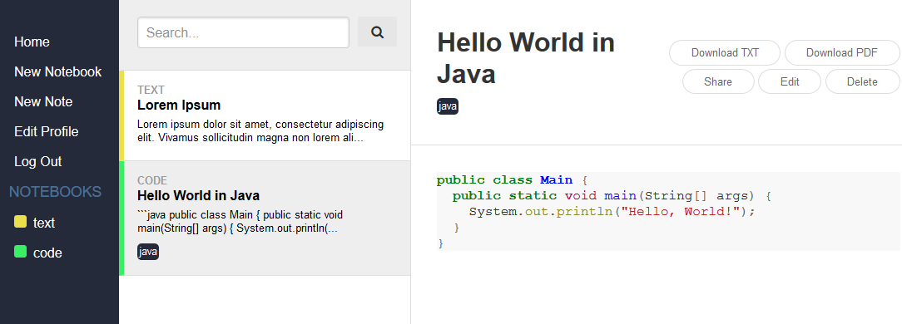
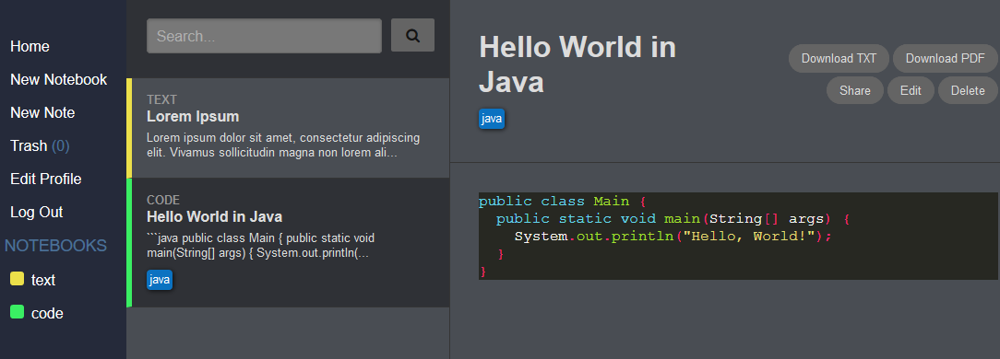
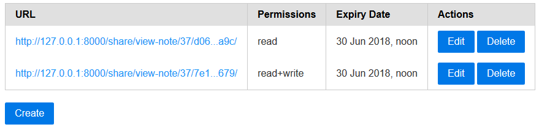

notes
========

A minimal note-taking web application using Django 2.0.6 licensed under the MIT License.

# Features
* Write notes using Markdown
* Syntax highlighting with 18 themes to choose from
* Organise notes using notebooks which are colour-coded and tags
* Share links with custom permissions
* Download notes and notebooks as TXT or PDFs
* Search notes and notebooks
* Mass manage notes in notebooks
* User accounts
* RESTful API
* Responsive design

# Usage
## Installation
```
python manage.py makemigrations
python manage.py migrate
python manage.py collectstatic
```

## Run
```
python manage.py runserver 127.0.0.1:8000
```

# Credits
* HTML Styling done using [PureCSS](https://purecss.io/) and [PureCSS Email Layout](https://purecss.io/layouts/email/).
* Syntax highlighting stylesheets from [pygments-css](https://github.com/richleland/pygments-css)
* Tags input field constructed using [django-tagify](https://github.com/PureCS/django-tagify)

# Samples
## Light theme


## Dark theme


## Share links

